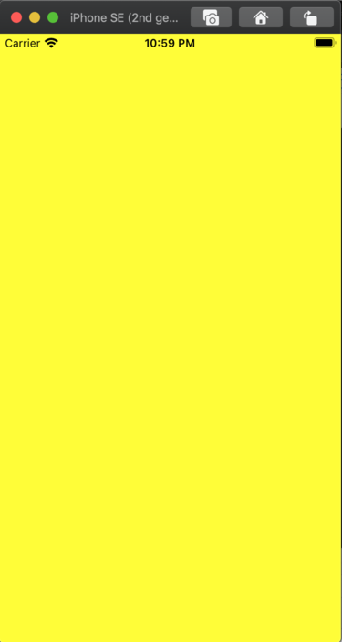
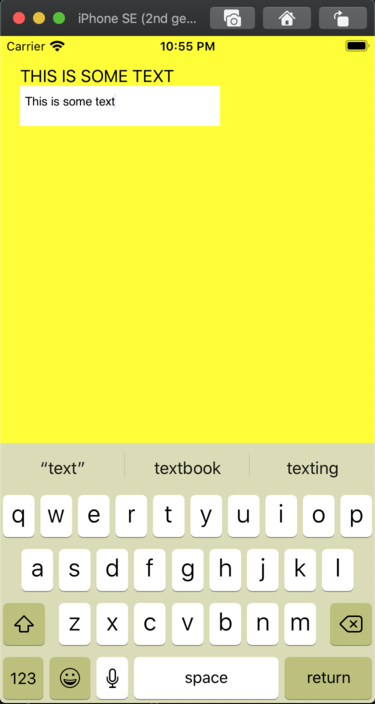

+++
title = "Building an (almost entirely) rust iOS app using uikit-sys."
date = 2020-08-17
description = "So, you really wanna build an iOS app in Rust..."
+++

# Introduction

In my last post, we learned how one could [use bindgen to generate Rust bindings
for an Objective-c framework](2020-08-14-rust-bindgen-objc-support) but didn't
show you how to use them. In this post, I show how to actually use those. This
will involve:
* [unsafe
rust](https://doc.rust-lang.org/stable/book/ch19-01-unsafe-rust.html)
* Learning some [uikit](https://developer.apple.com/documentation/uikit) concepts.
* Usage of [winit](https://github.com/rust-windowing/winit) on iOS and dealing
with some of the
[issues](https://github.com/rust-windowing/winit/issues?q=is%3Aissue+is%3Aopen+label%3A%22platform%3A+iOS%22+).
* How to mild use of [`cargo-bundle`](https://crates.io/crates/cargo-bundle)
and [`xcodegen`](https://github.com/yonaskolb/XcodeGen)

**disclosure**: Some of the `unsafe` rust in this post will have memory leaks.
There's been some [controversy about unsafe
rust](https://steveklabnik.com/writing/a-sad-day-for-rust). I want to say that
writing a safe wrapper for unsafe rust is important to me and I've spent a lot
of time thinking about how build a safe wrapper for `uikit-sys`. As of writing
this post, I've not yet figured it out.

# Setup

Many have written about doing this but let's do it again

`cargo new --lib use-uikit-sys` but you can name it whatever you
want. I'm naming it this way because it matches the directory in my
[simlay/blog-post-examples repo under the use-uikit-sys
 directory](https://github.com/simlay/blog-post-examples/tree/master/2020-08-17-use-uikit-sys).

Then you need to add `winit` and `uikit-sys` as dependencies but I like to also
add logging facilities as well. Your `Cargo.toml` should look something like:
```toml
[package]
name = "use-uikit-sys-blog-post"
version = "0.1.0"
authors = ["Sebastian Imlay <my-email@gmail.com>"]
edition = "2018"

[dependencies]
uikit-sys = { git = "https://github.com/simlay/uikit-sys" }
winit = "0.22.2"
```

To get started with `winit`, do exactly what's on their [current
guide](https://crates.io/crates/winit/0.22.2). So, your `src/lib.rs` should
look like:
```rust
use winit::{
    event::{Event, WindowEvent, StartCause},
    event_loop::{ControlFlow, EventLoop},
    window::WindowBuilder,
};
pub extern fn run_app() {
    let event_loop = EventLoop::new();
    let window = WindowBuilder::new().build(&event_loop).unwrap();

    event_loop.run(move |event, _, control_flow| {
        *control_flow = ControlFlow::Wait;

        match event {
            Event::NewEvents(StartCause::Init) => {
                println!("The app has started!");
            },
            Event::WindowEvent {
                event: WindowEvent::CloseRequested,
                window_id,
            } if window_id == window.id() => *control_flow = ControlFlow::Exit,
            _ => (),
        }
    });
}
```

## Using `cargo-bundle` to bundle an iOS app.

For the case of an example, I'd say `cargo-bundle` is the quickest way to
bundle an app but it's got some
[issues](https://github.com/burtonageo/cargo-bundle). It requires a
[`description`
field](https://doc.rust-lang.org/cargo/reference/manifest.html#the-description-field)
in your `Cargo.toml` which isn't there by default.

First off, you need an example to run in your bundle so you need to add `mkdir
examples` and then put the following in `examples/uikit.rs`:
```rust
use my_uikit_sys_app::run_app;

fn main() {
    run_app();
}
```

Then add a `package.metadata.bundle.example.uikit` section to your
`Cargo.toml`. Your `Cargo.toml` should now look like:
```toml
[package]
name = "use-uikit-sys-blog-post"
version = "0.1.0"
authors = ["Sebastian Imlay <my-email@gmail.com>"]
edition = "2018"
description = ""

[package.metadata.bundle.example.uikit]
name = "uikit"
identifier = "com.github.simlay.uikit"
category = "Utility"
short_description = "An example of a uikit-sys"
long_description = """An example of using uikit-sys
"""

[dependencies]
uikit-sys = { git = "https://github.com/simlay/uikit-sys" }
winit = "0.22.2"
```

At this point, you should run install cargo bundle, bundle the example into an
iOS app, install the app on a simulator and start the app as such:
```bash
$ cargo install cargo-bundle --git https://github.com/burtonageo/cargo-bundle
$ cargo bundle --example uikit --target x86_64-apple-ios
$ xcrun simctl install booted target/x86_64-apple-ios/debug/examples/bundle/ios/uikit.app
$ xcrun simctl launch --console booted com.github.simlay.uikit
```

I tend to put this stuff in a
[`Makefile`](https://github.com/simlay/blog-post-examples/blob/2b9a3abdd1ac71342c168772e408159c6db7b0e8/2020-08-17-use-uikit-sys/Makefile#L3-L13).

You will obviously need to have the [Xcode](https://developer.apple.com/xcode/)
installed and an [iOS simulator booted
up](https://help.apple.com/simulator/mac/current/#/devd856f9e4c). If you're not
familiar with `xcrun simctl` commands,
[nshipster](https://nshipster.com/simctl/) and
[xcblog](https://medium.com/xcblog/simctl-control-ios-simulators-from-command-line-78b9006a20dc)
are good sources.

Anyway, after you've ran `xcrun simctl launch --console booted
com.github.simlay.uikit`, the shell console should hang and display something
like:
```
com.github.simlay.uikit: 53589
The app has started!
```

Where in this case, `53589` is the PID of the app and `The app has started!` is
from the `println!` in the code above. Going over to the iOS simulator, you'll
notice that it's entirely blank. This is because we have literally nothing for
view. That's in the [Adding some stuff to the
view](#adding-some-stuff-to-the-view) below.

## Using `xcodegen` to bundle an iOS app.

I've used `cargo-bundle` for iOS and [fixed various
issues](https://github.com/burtonageo/cargo-bundle/pulls?q=is%3Apr+author%3Asimlay+is%3Aclosed)
but this is an issue I'm not sure how to fix
[burtonageo/cargo-bundle#91](https://github.com/burtonageo/cargo-bundle/issues/91).
For iOS features which you need to need to know how your
layout works, you might want to use `xcodegen`. It's a lot more complicated
than `cargo-bundle` but worth it.

Anyway, first off [install
`xcodegen`](https://github.com/yonaskolb/XcodeGen#installing) and
[`cargo-lipo`](https://github.com/TimNN/cargo-lipo), then you'll have to turn
your crate into a
[`staticlib`](https://doc.rust-lang.org/reference/linkage.html) by adding this
to your `Cargo.toml`:

```toml
[lib]
crate-type = ["staticlib", "lib"]
```
The `lib` will keep the existing functionality of [cargo-bundle](#using-cargo-bundle-to-bundle-an-ios-app).

add the following file to `project.yml`:
```yaml
name: uikit_example
options:
  bundleIdPrefix: com.rust
configs:
  Debug: debug
  Release: release
targets:
  cargo_ios:
    type: ""
    platform: iOS
    legacy:
      toolPath: /bin/sh
      arguments: "build_rust_deps.sh"
      workingDirectory: "."
  use_uikit_example:
    sources: ios-src/
    type: application
    platform: iOS
    deploymentTarget: "13.0"
    scheme:
      environmentVariables:
        - variable: RUST_BACKTRACE
          value: 1
          isEnabled: true
        - variable: RUST_LOG
          value: info
          isEnabled: true
        - variable: METAL_DEVICE_WRAPPER_TYPE
          value: 1
          isEnabled: true
    settings:
      base:
        OTHER_LDFLAGS: ["$(inherited)", "-luse_uikit_sys_blog_post"]
        ENABLE_BITCODE: NO
        CLANG_CXX_LANGUAGE_STANDARD: c++14
        CLANG_CXX_LIBRARY: libc++
      configs:
        debug:
          HEADER_SEARCH_PATHS: ["$(inherited)", "ios-src/"]
          LIBRARY_SEARCH_PATHS: ["$(inherited)", "./target/universal/debug"]
        release:
          HEADER_SEARCH_PATHS: ["$(inherited)", "ios-src/"]
          LIBRARY_SEARCH_PATHS: ["$(inherited)", "./target/universal/release"]
    dependencies:
      - sdk: Security.framework
      - sdk: UIKit.framework
      - target: cargo_ios
        embed: false
    info:
      path: ios-src/Info.plist
      properties:
        UILaunchStoryboardName: LaunchScreen
```

This describes the project layout to `xcodegen` which then generates an Xcode project. With this setup, you'll need:
```
+-- ios-src/
|   +-- main.m
|   +-- bindings.h
|   +-- Info.plist
+-- build_rust_deps.sh
```

[`Info.plist` is for the iOS app
metadata](https://developer.apple.com/library/archive/documentation/General/Reference/InfoPlistKeyReference/Introduction/Introduction.html),
[`build_rust_deps.sh`](https://github.com/simlay/blog-post-examples/blob/2b9a3abdd1ac71342c168772e408159c6db7b0e8/2020-08-17-use-uikit-sys/build_rust_deps.sh#L8)
really just wraps `cargo lipo`,
`bindings.h` contains only `void run_app(void);` and `main.m` has:
```c
#import "bindings.h"

int main() {
    run_app();
    return 0;
}
```
This is the only bit of non-rust programming in this project.

For now, `bindings.h` is hardcoded to match the function from `src/lib.rs` but
if you want to do this correctly, I recommend adding `build.rs` to your crate,
and use
[`cbindgen`](https://github.com/eqrion/cbindgen/blob/master/docs.md#buildrs)
to autogenerate the contents `bindings.h` based on your `#[no_mangle] extern
fn`s in your crate.

To make this project run:
```bash
$ xcodegen
$ xcodebuild -scheme use_uikit_example -configuration Debug -destination 'platform=iOS Simulator,name=iPhone SE (2nd generation),OS=13.6' -derivedDataPath build
$ xcrun simctl install booted build/Build/Products/Debug-iphonesimulator/use_uikit_example.app
$ xcrun simctl launch --console booted com.rust.use-uikit-example
```

At this point, you should get the same result as the [cargo-bundle](#using-cargo-bundle-to-bundle-an-ios-app) section:
```
com.rust.use-uikit-example: 63021
The app has started!
```

You can also just run `xcodegen` and open `uikit_example.xcodeproj` and push
the magic play button. Similar to the
[cargo-bundle](#using-cargo-bundle-to-bundle-an-ios-app) section, like adding a
[`Makefile`](https://github.com/simlay/blog-post-examples/blob/2b9a3abdd1ac71342c168772e408159c6db7b0e8/2020-08-17-use-uikit-sys/Makefile#L16-L26)
for these things.

One annoying thing about doing it via the `xcodebuild` command shown above is
that the
`-destination 'platform=iOS Simulator,name=iPhone SE (2nd generation),OS=13.6'`
argument changes with new updates to iPhones and
iOS versions. Someday I or someone will figure out a nice way of getting that
argument from `xcrun simctl list` but for now we hard code it.

# Adding some stuff to the view

So far, all we've done is make an app with a blank screen which is pretty
uninteresting so, let's add some views.

First off, let's change the background color.

To do this we'll need to import some new things:
```rust
use winit::platform::ios::WindowExtIOS;
use uikit_sys::{
    id,
    UIView,
    UIColor,
    IUIColor,
    UIView_UIViewRendering,
};
```
And then once you've created the window you need to get the root view via:
```rust
    let root_view: UIView = UIView(window.ui_view() as id);
    unsafe {
        root_view.setBackgroundColor_(UIColor::yellowColor());
    }

```

If you rerun the bundling steps from either the
[cargo-bundle](#using-cargo-bundle-to-bundle-an-ios-app) or the
[xcodegen](#using-xcodegen-to-bundle-an-ios-app) and you should have a yellow app
as seen here:



## So, what's this do?

So, first off when we do `UIView(window.ui_view() as id);` this is converting
the [`c_void`](https://doc.rust-lang.org/std/ffi/enum.c_void.html) that [winit
use for the root
view](https://github.com/rust-windowing/winit/blob/ec1ae68cfc9a14391afa2380a7f3a4f8f32dc813/src/platform/ios.rs#L111-L113)
and then casting it to an `id` which is a pointer to the objective-c object.
It's actually the same type [internally in the `Window`
struct](https://github.com/rust-windowing/winit/blob/ec1ae68cfc9a14391afa2380a7f3a4f8f32dc813/src/platform_impl/ios/window.rs#L443-L445).
Once we do that, we need to use the building blocks generated from the
`uikit-sys` crate.

One aspect of doing rust targeted at iOS is that [docs.rs](https://docs.rs/)
doesn't have the any docs for any iOS targeted stuff. It's due to iOS targets
needing `xcrun` installed on the system and docs.rs runs on ubuntu. To really
get docs for your project, you should do `cargo doc --target x86_64-apple-ios
--document-private-items --open` to get the `winit` and `uikit-sys` docs.

Now, the `unsafe` block to run
`root_view.setBackgroundColor_(UIColor::blueColor());` is the thing that
actually set's the color. This is required to be `unsafe` because everything
inside of that logic is autogenerated from the UIKit framework headers and crosses the FFI boundary. If
you're curious where they are I recommend looking in `$(xcrun --sdk
        iphonesimulator
        --show-sdk-path)/System/Library/Frameworks/UIKit.framework/Headers/`

Anyway, `bindgen` produces some typed bindings for objective-c. I've spent a
bit of [time in the last year trying to make them
better](https://github.com/rust-lang/rust-bindgen/pulls?q=is%3Apr+author%3Asimlay+).
So, `UIColor::blueColor()` returns a `UIColor` which is just:
```rust
#[repr(transparent)]
#[derive(Clone, Copy)]
pub struct UIColor(pub id);
```
The `repr(transparent)` is the magic behind having `UIColor::blueColor()`
return a `UIColor` instance. I sumarized this in [my last
post](../rust-bindgen-objc-support/#so-what-have-we-built).

Now, the `root_view.setBackgroundColor_(UIColor::blueColor())` matches the
[background color instance property
assignment](https://developer.apple.com/documentation/uikit/uiview/1622591-backgroundcolor?language=objc)
which is the objective-c equivalent to:
```objc
root_view.backgroundColor = [UIColor blueColor];
```
Due to the FFI aspect of this, the above statement doesn't translate to rust so
to assign things, bindgen gives you `setFoo_` for a property `Foo` that is not `readonly`.

In order to use the `setBackgroundColor_` function, you need to import
[`UIView_UIViewRendering`](https://simlay.net/uikit-sys/master/uikit_sys/trait.UIView_UIViewRendering.html).
this is because the background and other rendering methods are all in the
`UIViewRendering` category of `UIView`. From what I can tell, the objective-c
engineers at apple use categories as way to organize the sections of code.


# Let's add some text and a text field.

To do this, the building blocks are
[`UILabel`](https://developer.apple.com/documentation/uikit/uilabel) and
[`UITextField`](https://developer.apple.com/documentation/uikit/uitextview?language=objc)
from the apple docs. You can checkout the `uikit-sys` equivalents at
[`UILabel`](https://simlay.net/uikit-sys/master/uikit_sys/struct.UILabel.html)
and
[`UITextView`](https://simlay.net/uikit-sys/master/uikit_sys/struct.UITextView.html).

## UILabel

Let's write a function that's called upon the
`Event::NewEvents(StartCause::Init)` branch of the main event loop in winit:
```rust
Event::NewEvents(StartCause::Init) => {
    add_label("THIS IS SOME TEXT".to_string(), root_view);
    println!("The app has started!");
},
```
with the `add_label` function thusly:
```rust
fn add_label(label_text: String, root_view: UIView) {
    use uikit_sys::{
        UILabel,
        IUILabel,
        NSString,
        INSObject,
        UIView_UIViewHierarchy,
        UIView_UIViewGeometry,
        NSString_NSStringExtensionMethods,
        NSUTF8StringEncoding,
        CGRect,
        CGPoint,
        CGSize,
    };

    use std::{
        ffi::CString,
        convert::TryInto,
    };
    let text = CString::new(label_text.as_str()).expect("CString::new failed");
    let text_ptr = text.as_ptr();
    let text_length = label_text.len().try_into().unwrap();
    unsafe {
        let label = UILabel::alloc();
        label.init();

        let text = NSString(
            NSString::alloc().initWithBytes_length_encoding_(
                text_ptr as *mut std::ffi::c_void,
                text_length,
                NSUTF8StringEncoding,
            ),
        );

        label.setFrame_(CGRect {
            origin: CGPoint {
                x: 20.0,
                y: 20.0,
            },
            size: CGSize {
                width: 200.0,
                height: 40.0,
            },
        });
        label.setText_(text);

        root_view.addSubview_(UIView(label.0));
    }
}
```
Rebuilding and running the app you get:


You'll notice that this is quite a bit of code with a huge `unsafe` block just
to get a bit of text on the screen. In fact, there's more `unsafe` function
calls here than there are safe function calls. The only thing that really could
be factored out of this block is the creation of `CGPoint`, `CGRect`, and
`CGSize`.  In my original [implementation of this](https://github.com/simlay/blog-post-examples/blob/2b9a3abdd1ac71342c168772e408159c6db7b0e8/2020-08-17-use-uikit-sys/src/lib.rs#L65-L73), I actually had the
[`CString`](https://doc.rust-lang.org/std/ffi/struct.CString.html) conversion
in the `unsafe` block but after reading the docs for
[`as_ptr`](https://doc.rust-lang.org/std/ffi/struct.CString.html#method.as_uptr).
I concluded that this exhibited some undefined behavior.

That is why there is:
```rust
    let text = CString::new(label_text.as_str()).expect("CString::new failed");
    let text_ptr = text.as_ptr();
    let text_length = label_text.len().try_into().unwrap();
```

If you were to do `let text_ptr =
CString::new(label_text.as_str()).expect("CString::new failed").as_ptr()`, you
might end up with some undefined behavior.

So, the question here is "when `initWithBytes_length_encoding_` is called, does
it take ownership? Otherwise will there be a memory leak?". If we look at
[`objc-foundation`](https://github.com/SSheldon/rust-objc-foundation/blob/15f9ebec1190889e48a4bc2d36601e61d303071f/src/string.rs#L53-L63)
and
[`core-foundation`](https://github.com/servo/core-foundation-rs/blob/69c09ab8fda5f84c795354fa664132211f755e7e/cocoa-foundation/src/foundation.rs#L624-L629),
these implementations imply that the memory is copied when passed to the
Objective-c side. I've failed at finding a place where it explicitly says it
copies the bytes on the objective-c side but if
[`initWithBytesNoCopy:length:encoding:freeWhenDone:`](https://developer.apple.com/documentation/foundation/nsstring/1413830-initwithbytesnocopy?language=objc)
doesn't copy the bytes and optionally frees it, that implies that
[`initWithBytes:length:encoding:`](https://developer.apple.com/documentation/foundation/nsstring/1407339-initwithbytes?language=objc)
does copy the bytes.

### Will this leak memory?

So, what happens if we call `add_label` multiple times? Well, in short, it
currently leaves the memory allocated and the objective-c side of the FFI
leaves this as a dangling pointer. We should definitely feel bad about it but I
or someone else will write a post on how to do this in a more correct and safe way.

# UITextView

In the past, I've made
[`iced`](https://github.com/hecrj/iced/pull/57) work on iOS but there was no
keyboard input and makes it a little hard to use. So, using the native keyboard pop up and work is pretty important to an iOS app.

To start, Let's put a `add_text_view` call in the `Event::NewEvents(StartCause::Init)` branch of the main event loop in winit [similar to above](#uilabel):
```rust
Event::NewEvents(StartCause::Init) => {
    add_label("THIS IS SOME TEXT".to_string(), root_view);
    add_text_view(root_view);
    println!("The app has started!");
},
```
And add a `add_text_view` function:
```rust
fn add_text_view(root_view: UIView) {
    use uikit_sys::{
        CGRect,
        CGPoint,
        CGSize,
        UITextView,
        IUITextView,
        UIView_UIViewHierarchy,
        UIView_UIViewGeometry,
        INSObject,
    };
    let _textview = unsafe {
        let ui_textview = {
            let view = UITextView(UITextView::alloc().init());
            view.setFrame_(CGRect {
                origin: CGPoint {
                    x: 20.0,
                    y: 50.0,
                },
                size: CGSize {
                    width: 200.0,
                    height: 40.0,
                },
            });
            root_view.addSubview_(UIView(view.0));
            view
        };
        ui_textview
    };
}
```

Now when you bundle the app you will have something like:




Funny enough, this section is much simler than the [`UILabel`
section](#uilabel) but mostly because a lot of it is the same idea. We're not
passing in pointers to `CStrings`, we're passing in some structs for the
geometry of the frame across the FFI. Similar to the last section, we've just
thrown memory collection out the window for now.

# Thoughts on uikit-sys

The most annoying thing about this development is that you will need to read
both the Apple's UIKit docs and the generated docs from `uikit-sys`.  There are
plenty of comments in the objective-c headers but adding them to the generated
rust isn't an option. Perhaps it's possible to have source maps?

Due to the nature of working on such an obscure subject, I have been [passing
the buck](https://idioms.thefreedictionary.com/pass+the+buck) on the
topic until this post. [Apple has recommendations
page](https://developer.apple.com/library/archive/documentation/Cocoa/Conceptual/MemoryMgmt/Articles/MemoryMgmt.html#//apple_ref/doc/uid/10000011-SW1)
which I think the objective-c features `retain` and `relaese `could actually
match well with `Clone` and `Drop` in rust but that's a discussion for another time.

# Closing thoughts

So, this is a way you could in theory build an iOS app. It's missing a lot.
Things like the text input events are missing, updating different events are
missing, basic memory management like if you were trying to burn the bits. Because of this, I cannot
say that I would recommend `uikit-sys` over
[SwiftUI](https://developer.apple.com/documentation/swiftui) or just plane ol'
objective-c and UIKit. From what I can tell, this is the first time someone's
tried this hard not to build an iOS app using so few of the apple recommended
libraries. I'm not even sure that this type of work will pass some of the apple
automated app review stuff.

What we (or maybe just I) should do is use `uikit-sys` in something like
[`iced`](https://github.com/hecrj/iced) which would make that something similar
to a mobile-friendly-cross-platform GUI crate. I will leave that guide for
another time :)
